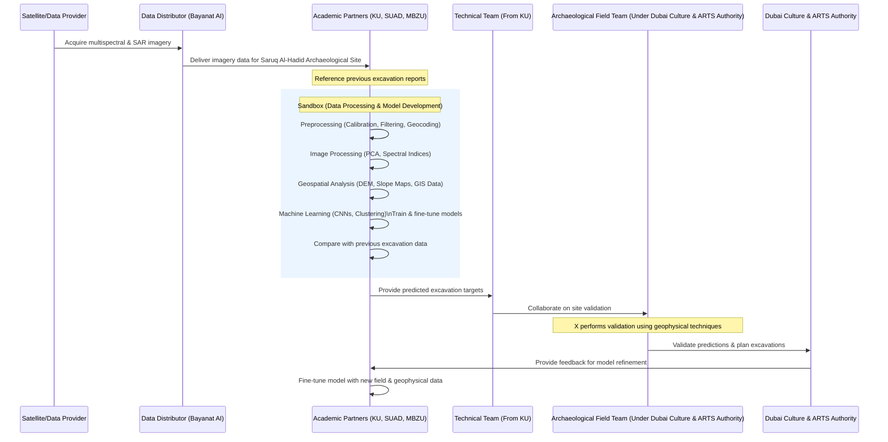

```mermaid
sequenceDiagram
    participant Sat as Satellite/Data Provider
    participant Bay as Data Distributor (Bayanat AI)
    participant Acad as Academic Partners (KU, SUAD, MBZU)
    participant Tech as Technical Team (From KU)
    participant Field as Archaeological Field Team (Under Dubai Culture & ARTS Authority)
    participant Culture as Dubai Culture & ARTS Authority

    %% 1. Data Acquisition & Delivery
    Sat->>Bay: Acquire multispectral & SAR imagery
    Bay->>Acad: Deliver imagery data for Saruq Al-Hadid Archaeological Site

    %% 2. Sandbox: Data Processing & Model Development
    note over Acad: Reference previous excavation reports
    rect rgb(235, 245, 255)
    note over Acad: Sandbox (Data Processing & Model Development)

    Acad->>Acad: Preprocessing (Calibration, Filtering, Geocoding)
    Acad->>Acad: Image Processing (PCA, Spectral Indices)
    Acad->>Acad: Geospatial Analysis (DEM, Slope Maps, GIS Data)
    Acad->>Acad: Machine Learning (CNNs, Clustering)\nTrain & fine-tune models
    Acad->>Acad: Compare with previous excavation data

    end

    %% 3. Providing Predictions
    Acad->>Tech: Provide predicted excavation targets
    %% 4. On-Site Validation (Geophysical Techniques, Excavation)
    Tech->>Field: Collaborate on site validation
    note over Field: X performs validation using geophysical techniques
    Field->>Culture: Validate predictions & plan excavations

    %% 5. Feedback & Fine-Tuning
    Culture->>Acad: Provide feedback for model refinement
    Acad->>Acad: Fine-tune model with new field & geophysical data
```